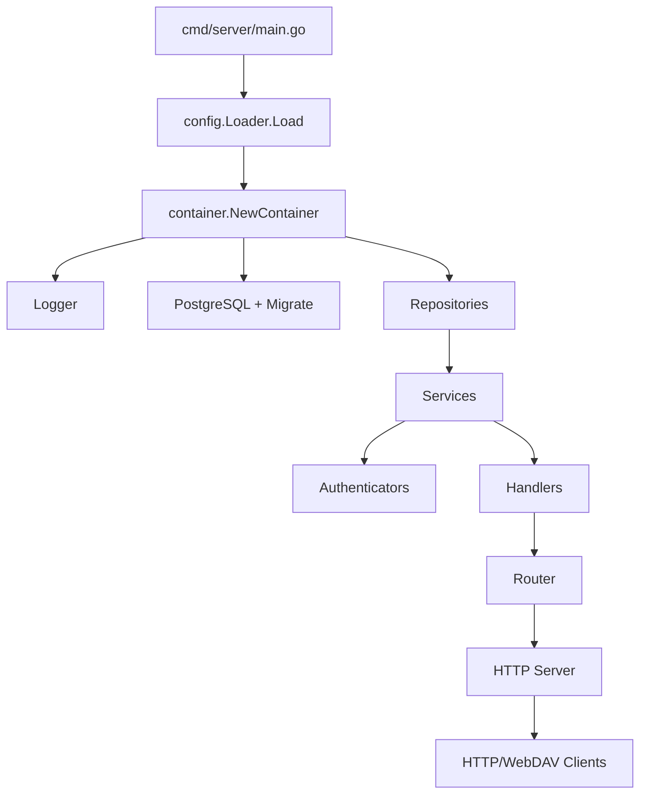

# Architecture Overview

This document summarizes the system architecture, component responsibilities, and startup flow.

## Goals / Non-goals

- Goals: explain component dependencies, runtime flow, module boundaries.
- Non-goals: API field-level details (see `docs/webdav-api.md`).

## Module Layout

- `cmd/server`: process entry; parse flags, load config, start server
- `internal/container`: DI container; wires all components
- `internal/interface/http`: HTTP router, middleware, API/WebDAV handlers
- `internal/application/service`: business services (WebDAV/share/recycle, etc.)
- `internal/domain`: domain models and rules
- `internal/infrastructure`: DB/config/auth/logging and other infra
- `internal/infrastructure/webdav`: custom WebDAV filesystem

## Startup Flow

1. `cmd/server/main.go` parses flags and loads config (file + flags + env).
2. `container.NewContainer` initializes in order:
   - Logger
   - PostgreSQL + migrations
   - Repositories
   - Services
   - Authenticators (Basic + Web3/UCAN)
   - Handlers
   - Router + Server
3. HTTP server starts; graceful shutdown on signals.

Config validation highlights:

- `config.users` must contain at least one user (validated before startup).
- `web3.jwt_secret` is required and must be at least 32 characters.
- `database.type` supports only `postgres`/`postgresql`.



## Runtime Dependencies

- **Container** orchestrates initialization order and lifecycle.
- **Router** mounts API/WebDAV routes on `http.ServeMux`.
- **Middleware** order: `Recovery -> Logger -> CORS (optional)`.
- **Auth**: protected routes use `AuthMiddleware`, supporting Basic or Web3/Bearer.

## Routing Layers

- Public (no auth):
  - Health: `/api/v1/public/health/heartbeat`
  - Web3 auth: `/api/v1/public/auth/*`
- Protected APIs: quota, user info, recycle, share, address book
- WebDAV: all requests under `webdav.prefix` (default `/`)

## Middleware + Auth Chain

```mermaid
flowchart LR
    R[Incoming Request] --> MW1[Recovery]
    MW1 --> MW2[Logger]
    MW2 --> MW3{CORS enabled?}
    MW3 -->|yes| MW4[CORS]
    MW3 -->|no| MW5[Next]
    MW4 --> MW5
    MW5 --> AM[AuthMiddleware (protected routes only)]
    AM --> H[Handler]
```

- `AuthMiddleware` selects an authenticator by credential type:
  - Basic: `Authorization: Basic ...`
  - Web3: `Authorization: Bearer ...` or `authToken` cookie
- For WebDAV requests with missing credentials, it returns `WWW-Authenticate`.
