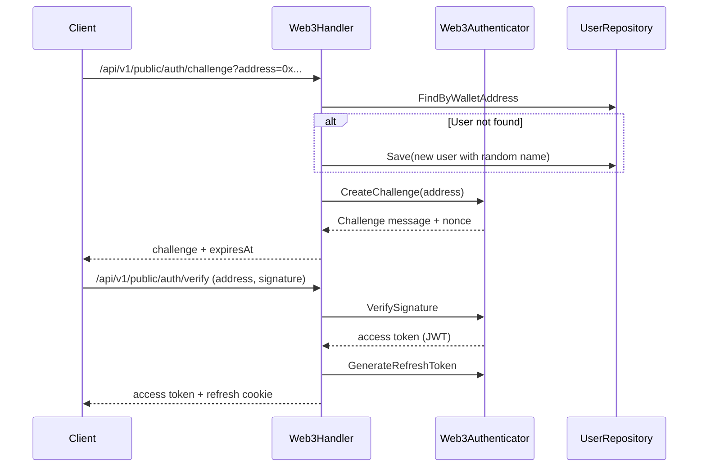
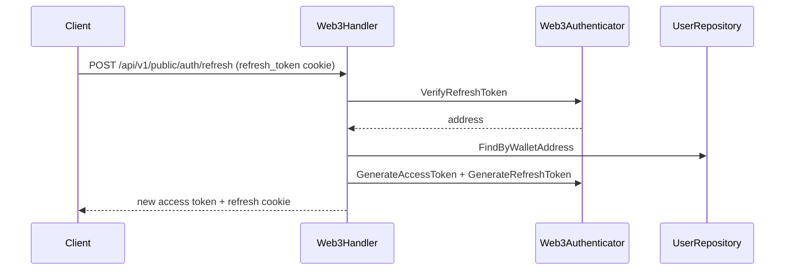

# Authentication Design

This document summarizes the authentication system: Basic auth, Web3/JWT/UCAN tokens, and refresh flow.

## Authenticators

Two authenticators are wired by the container:

- **BasicAuthenticator**: username/password auth (optional no-password mode)
- **Web3Authenticator**: Bearer token auth supporting JWT and UCAN

`AuthMiddleware` selects the authenticator based on credential type.

## Credential Sources & Priority

Extraction order in `AuthMiddleware`:

1. `Authorization: Bearer <token>`
2. `authToken` cookie (treated as Bearer)
3. HTTP Basic Auth

For WebDAV requests with missing credentials, a `WWW-Authenticate` header is returned.

## Basic Auth

- Users live in PostgreSQL `users` table; password stored as bcrypt hash.
- `security.no_password=true` bypasses password check (username only).
- Permissions are derived from `users.permissions` and `user_rules`.

## Resource Access Permission Design

Authentication only establishes identity; authorization is handled by the permission system (independent of Basic/JWT/UCAN).

### Sources & Precedence

- Default permissions come from `users.permissions` (`C/R/U/D`).
- Path rules come from `user_rules`, evaluated in order; first match wins.
- If no rule matches, fall back to default permissions.

### WebDAV Resources

- Permission checks happen before WebDAV handling.
- The logical path is `(user.Directory || user.Username) + request path`, then normalized.
- HTTP method → permission:
  - `GET/HEAD/OPTIONS/PROPFIND` → Read (`R`)
  - `PUT/PATCH/PROPPATCH` → Write (`U`)
  - `POST/MKCOL` → Create (`C`)
  - `COPY/MOVE` → Write (`U`)
  - `DELETE` → Delete (`D`)
  - Other methods default to Read
- `Create/Write` also validates that the parent directory exists.

### API / Share / Recycle

- Public share (Share): read-only (download only).
- Share User: permissions come from `share_user_items.permissions`, checked for download/upload/create/rename/delete.
- Recycle: only the owner can recover/remove/clear items.

## Web3 / JWT Auth

### Challenge & Verify



### Auto-registration

When the address is not found during `HandleChallenge`, the server auto-creates a user:

- Random username (e.g., `QuickFox42`)
- Default permissions `CRUD`
- Default quota `100GB` (`107374182400` bytes)

### Refresh Flow



### Password Login (JWT Bridge)

- `/api/v1/public/auth/password/login` accepts username/password.
- User must have a wallet address bound.
- Access/refresh tokens are issued for that wallet address.

## UCAN Support

- When `web3.ucan.enabled=true`, Bearer tokens that look like UCAN JWS are verified as UCAN.
- Validation includes:
  - `audience` matches `web3.ucan.audience` (default `did:web:localhost:<port>`)
  - capabilities include `required_resource` and `required_action`
  - proof chain verification (SIWE / ed25519 proof)
- On success, issuer `did:pkh:eth:<address>` is mapped to a user.

### Resource / Action Details (for DApp Integration)

UCAN capabilities are expressed as: `cap: [{ resource, action }]`. The server turns
`web3.ucan.required_resource` and `web3.ucan.required_action` into a required capability
and checks it during authentication. Matching rules:

- **Empty values**:
  - Both empty: no capability check (only UCAN verification).
  - Only `resource` set: `action` is treated as `"*"`.
  - Only `action` set: `resource` is treated as `"*"`.
- **Matching semantics**:
  - `"*"` matches any value.
  - Suffix `"*"` means prefix match (e.g. `webdav/*` matches `webdav/foo`).
  - Otherwise, values must be equal.

> Current implementation only checks whether the required resource/action is present,
> **it does not** map UCAN actions to WebDAV method-level permissions.

### UCAN Resource Permissions for Login

- `resource/action` are opaque strings with no fixed enum; the supported scope is defined by `web3.ucan.required_resource` / `required_action`.
- UCAN only gates authentication via required capability checks; it **does not** replace the user's `C/R/U/D` permissions or rules.
- If you need fine-grained UCAN-based authorization, enforce it at the DApp or gateway level (not built into the server yet).

#### How a DApp should choose resource/action

Use the server configuration values (`web3.ucan.required_resource` / `required_action`),
and include at least one capability entry that satisfies them.

Example (server requires `resource=webdav`, `action=read`):

```json
{
  "cap": [
    { "resource": "webdav", "action": "read" }
  ]
}
```

Example (server requires `resource=webdav/*`, `action=*`):

```json
{
  "cap": [
    { "resource": "webdav/files/*", "action": "write" }
  ]
}
```

## Cookie & Security Notes

- Refresh token is issued as `refresh_token` cookie with `HttpOnly`.
- `Secure` flag is determined by TLS or `X-Forwarded-Proto`.
- Access token is returned in response body and must be stored client-side.
