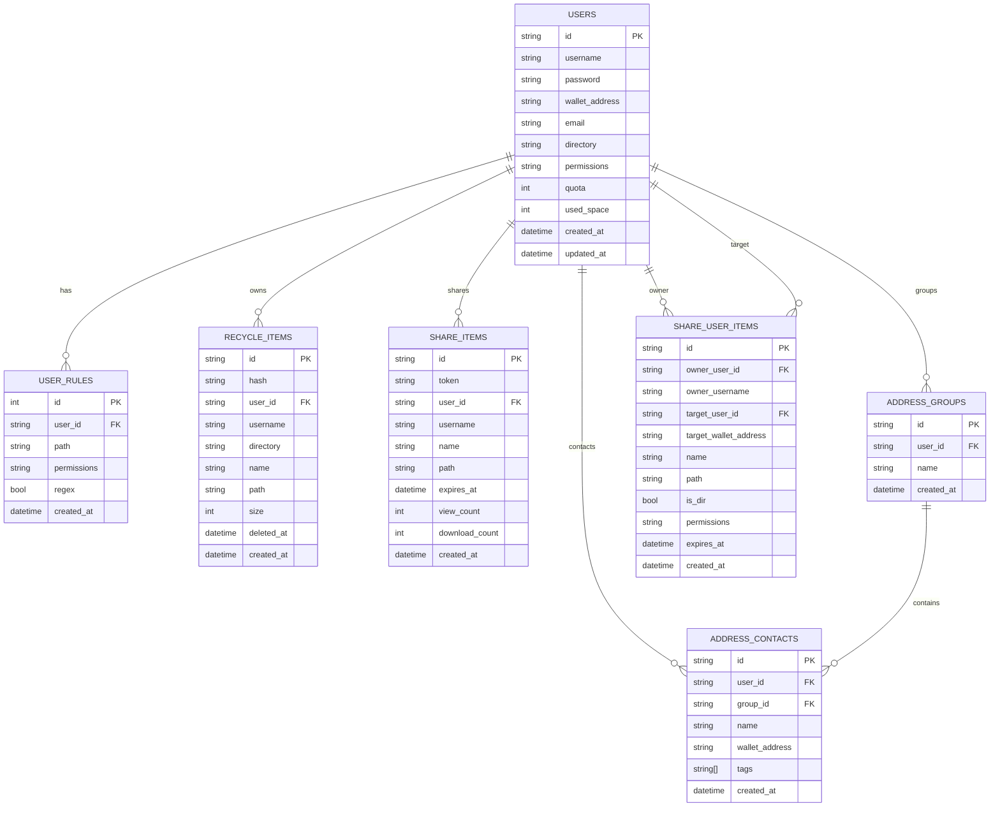

# Data Model

This document summarizes the PostgreSQL schema and key relationships.

## ER Diagram

## Key Tables

- **users**: core user record with permissions, quota, and wallet address.
- **user_rules**: path-level rules that override default permissions.
- **recycle_items**: deleted file records for restore/permanent delete.
- **share_items**: public share records keyed by token.
- **share_user_items**: targeted share records (to specific users).
- **address_groups / address_contacts**: address book and contacts.

## Indexes & Constraints (summary)

- `users.username` unique
- `users.wallet_address` unique (when non-null)
- `users.email` unique (when non-null)
- `share_items.token` unique
- `recycle_items.hash` unique
- `address_groups(user_id, name)` unique
- `address_contacts(user_id, wallet_address)` unique
