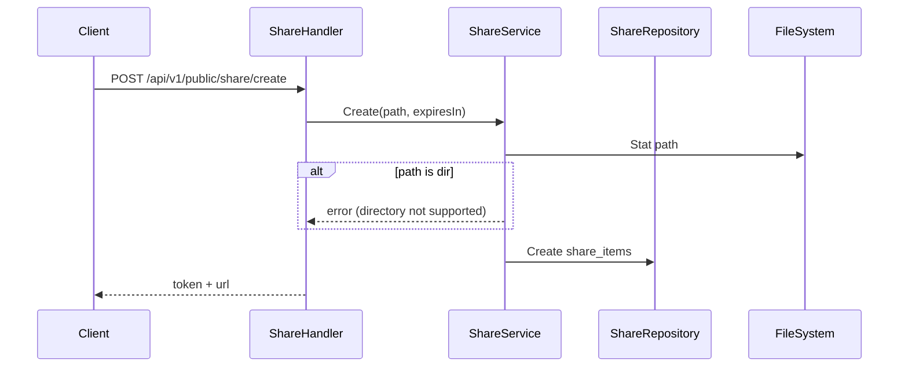
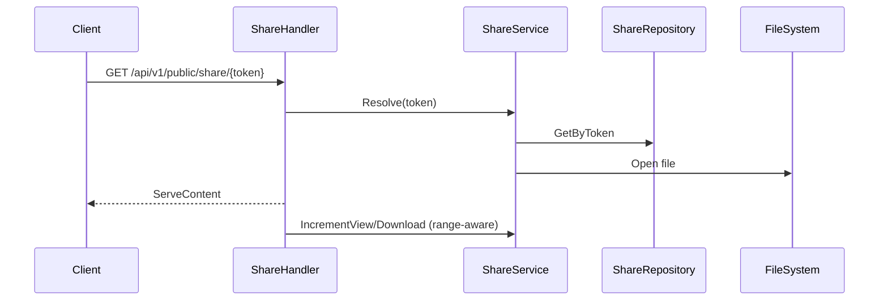
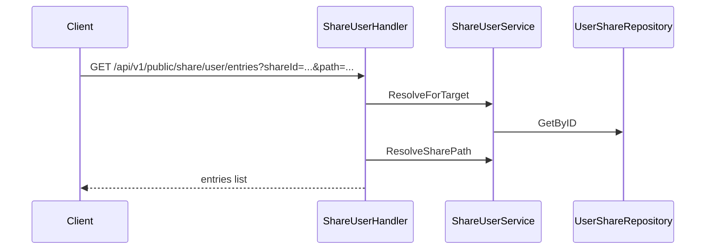

# Sharing & Recycle Design

This document covers public sharing, targeted sharing, and the recycle bin lifecycle.

## Public Sharing (Share)

### Create

- Public shares support **files only** (directories are rejected).
- `expiresIn` adds an optional expiry time.

### Access

- Only the first range segment increments counters to avoid over-counting.

## Targeted Sharing (Share User)

### Creation & Permissions

- Target user is resolved by wallet address.
- `permissions` can be `read/create/update/delete` (or `CRUD` string).
- Files or directories are supported.
- Successful create auto-adds the target to address book (if absent).

### Usage Example

- Download, upload, create folder, rename, delete all require permission checks.

## Recycle Bin

### Write to Recycle (from WebDAV DELETE)

- WebDAV delete attempts to move the file into `.recycle`.
- A `recycle_items` record is created with hash/path/size/deleted time.

### Restore & Purge

- `recover`: move file back to original location; fails if target exists.
- `permanent`: delete recycle file and remove record.
- `clear`: batch clear all items.

### Naming Strategy

- New: `{hash}_{original name}`
- Legacy: `{username}_{directory}_{name}_{timestamp}`

