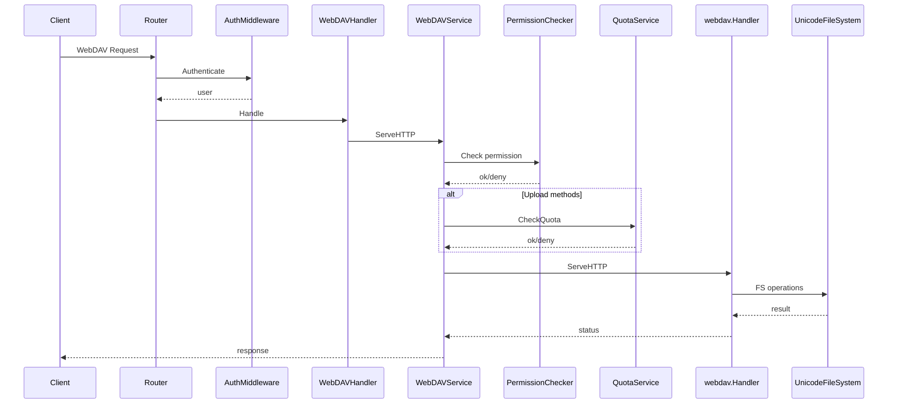
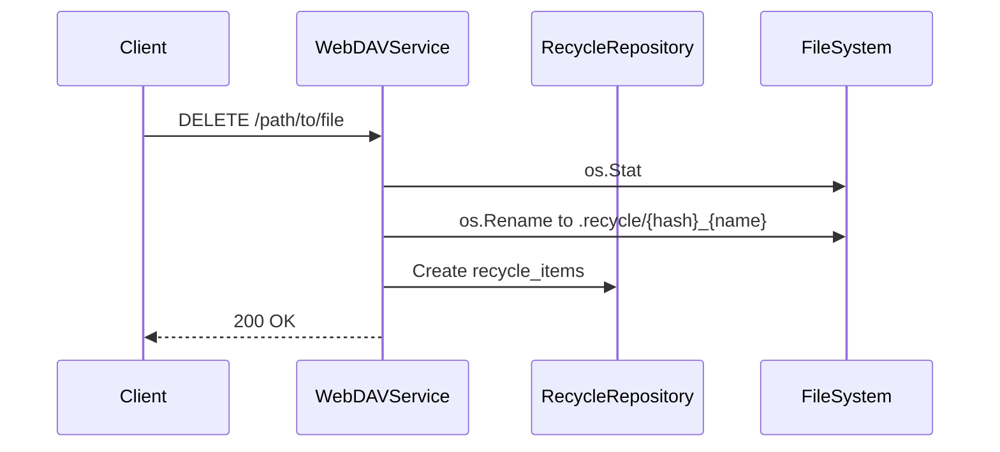

# WebDAV Request Flow

This document describes how WebDAV requests are processed, including permissions, quota checks, and recycle behavior.

## End-to-end Flow

## Key Steps

1. **Auth**: `AuthMiddleware` retrieves the user; otherwise rejects.
2. **Ignored system files**: `.DS_Store`, `.AppleDouble`, `Thumbs.db`, and `._*` are treated as non-existent.
3. **User directory resolution**:
   - Absolute `user.Directory` is used as-is.
   - Otherwise `webdav.directory + user.Directory`.
   - If `user.Directory` is empty, fallback to `webdav.directory`.
   - Permission checks use `user.Directory` or `user.Username` as the logical prefix.
4. **Permission check**: HTTP method → operation (C/R/U/D), checked against rules or defaults.
5. **Quota check**: `PUT/POST/MKCOL` validate additional size against quota.
6. **WebDAV handler**:
   - Uses custom `UnicodeFileSystem` for Unicode-safe paths.
   - Uses in-memory lock system `webdav.NewMemLS()`.
7. **DELETE**: move file into `.recycle` and create a DB record.
8. **Usage refresh**: successful mutating operations recompute and persist `used_space`.

## Method → Permission Mapping

- `GET/HEAD/OPTIONS/PROPFIND` → Read (`R`)
- `PUT/PATCH/PROPPATCH` → Write (`U`)
- `POST/MKCOL` → Create (`C`)
- `COPY/MOVE` → Write (`U`)
- `DELETE` → Delete (`D`)
- Other methods default to Read

Permission matching:

1. If path matches `user_rules`, use rule permissions.
2. Otherwise use `users.permissions` default.

Note: `user_rules.regex=true` is not implemented in code; rule matching is prefix-only.

## DELETE → Recycle Flow

- If move fails, it falls back to direct deletion.
- Recycle naming: `{hash}_{original name}`.

## MOVE/COPY Destination Normalization

`Destination` header is decoded and normalized to avoid proxy/encoding path issues.
