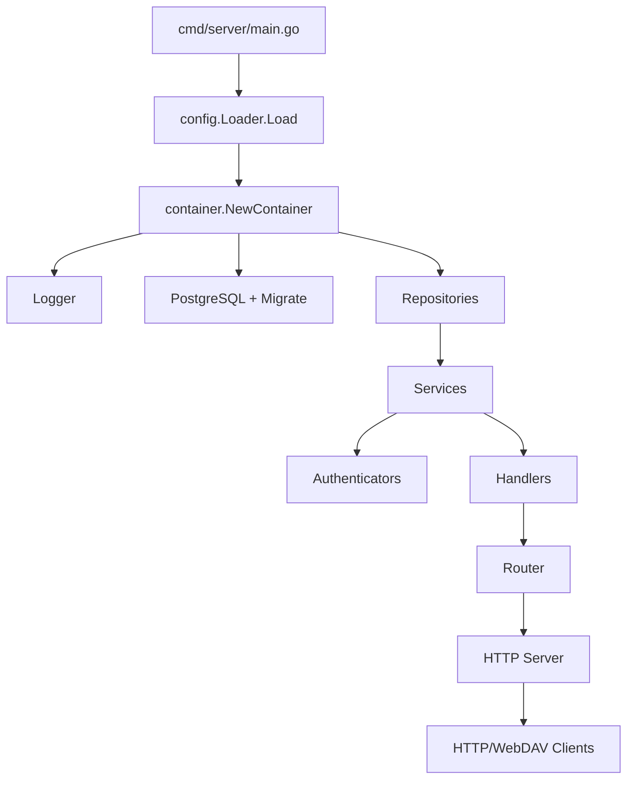

# 架构概览

本文档描述 WebDAV 服务的整体架构、主要模块职责与启动流程。

## 目标与非目标

- 目标：解释组件之间的依赖关系、核心运行时链路、模块划分。
- 非目标：接口细节与字段含义（详见 `docs/webdav-api.md`）。

## 模块划分

- `cmd/server`：进程入口，解析参数、加载配置、启动服务
- `internal/container`：依赖注入容器，负责初始化各类组件
- `internal/interface/http`：HTTP 路由、处理中间件、API/WebDAV Handler
- `internal/application/service`：业务服务（WebDAV/分享/回收站等）
- `internal/domain`：领域模型与规则（用户/权限/分享/回收站）
- `internal/infrastructure`：数据库、配置、认证、日志等基础设施
- `internal/infrastructure/webdav`：自定义 WebDAV 文件系统实现

## 启动流程

1. `cmd/server/main.go` 解析参数并加载配置（文件 + flag + env）。
2. `container.NewContainer` 依次初始化：
   - Logger
   - PostgreSQL + 迁移
   - Repository
   - Service
   - Authenticator（Basic + Web3/UCAN）
   - Handler
   - Router + Server
3. 启动 HTTP 服务，等待系统信号，优雅关闭。

配置校验要点：

- `config.users` 必须至少包含一个用户（启动前校验）。
- `web3.jwt_secret` 必填且长度至少 32。
- `database.type` 仅支持 `postgres`/`postgresql`。



## 运行时依赖关系

- **Container**：贯穿所有依赖的构建中心，控制初始化顺序与生命周期。
- **Router**：负责将 API/WebDAV 路由挂载到 `http.ServeMux`。
- **Middleware**：全局中间件顺序为 `Recovery -> Logger -> CORS(可选)`。
- **认证**：对受保护路由使用 `AuthMiddleware`，支持 Basic 或 Web3/Bearer。

## 路由分层

- 公共路由（不需要认证）：
  - 健康检查 `/api/v1/public/health/heartbeat`
  - Web3 登录流程 `/api/v1/public/auth/*`
- 受保护 API：配额、用户信息、回收站、分享、地址簿等
- WebDAV：`webdav.prefix` 前缀下的所有请求（默认 `/`）

## 中间件与认证链路

```mermaid
flowchart LR
    R[Incoming Request] --> MW1[Recovery]
    MW1 --> MW2[Logger]
    MW2 --> MW3{CORS enabled?}
    MW3 -->|yes| MW4[CORS]
    MW3 -->|no| MW5[Next]
    MW4 --> MW5
    MW5 --> AM[AuthMiddleware (protected routes only)]
    AM --> H[Handler]
```

- `AuthMiddleware` 会按凭证类型选择认证器：
  - Basic：`Authorization: Basic ...`
  - Web3：`Authorization: Bearer ...` 或 `authToken` Cookie
- WebDAV 请求在缺少凭证时会返回 `WWW-Authenticate` 以适配 WebDAV 客户端。
