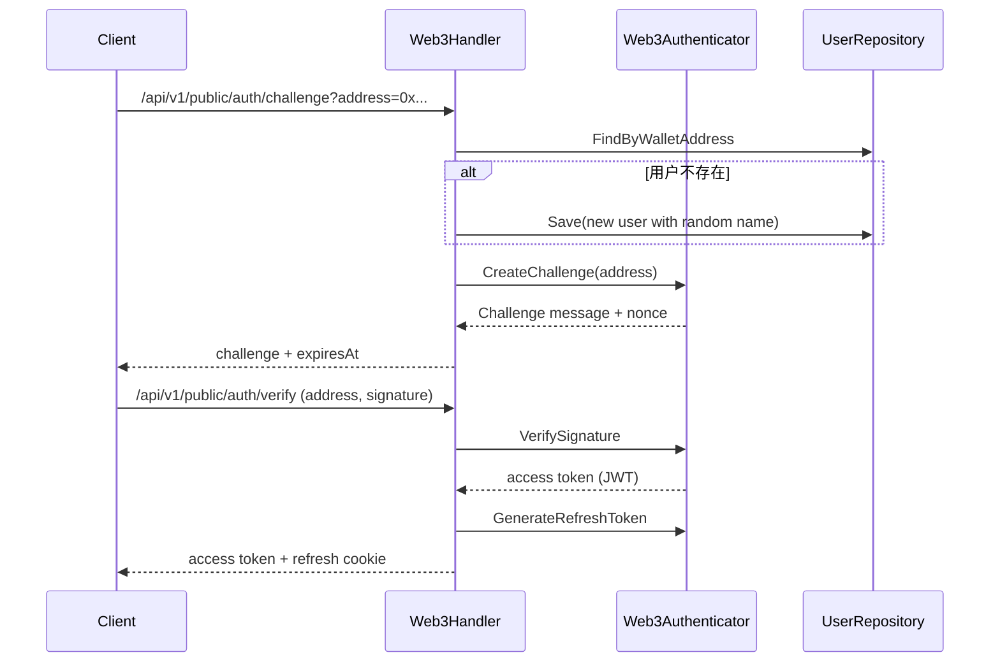
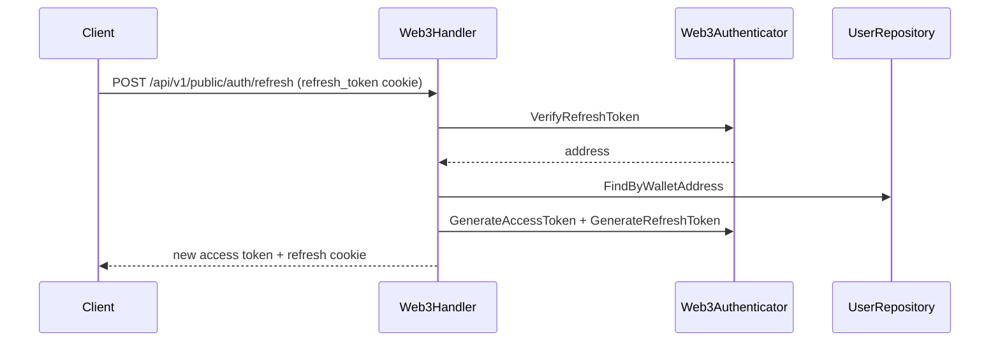

# 认证设计

本文档概述 WebDAV 服务的认证体系：Basic 认证、Web3 认证、JWT/UCAN 令牌与刷新机制。

## 认证器概览

系统在容器中初始化两类认证器：

- **BasicAuthenticator**：用户名/密码认证（可配置无密码模式）
- **Web3Authenticator**：Bearer Token 认证，支持 JWT 和 UCAN

认证中间件会根据请求凭证类型选择可处理的认证器。

## 凭证来源与优先级

`AuthMiddleware` 的凭证提取顺序：

1. `Authorization: Bearer <token>`
2. `authToken` Cookie（当作 Bearer Token）
3. HTTP Basic Auth

如果是 WebDAV 请求且缺少凭证，会返回 `WWW-Authenticate` 以满足客户端行为。

## Basic 认证

- 用户存储在 PostgreSQL 的 `users` 表中，密码使用 bcrypt 哈希。
- `security.no_password=true` 时，Basic 认证跳过密码校验（仅依赖用户名）。
- 用户权限由 `users.permissions` 与 `user_rules` 控制。

## 访问资源的权限设计

认证只确认“是谁”，资源访问授权由权限系统统一控制（与 Basic/JWT/UCAN 基本无关），  
但当 UCAN 携带 `app:<appId>` 时，会额外做应用目录前缀与读写动作限制。

### 权限来源与优先级

- 用户默认权限来自 `users.permissions`（`C/R/U/D`）。
- 路径规则来自 `user_rules`，按配置顺序匹配；命中后直接使用该规则权限，不再继续匹配。
- 未命中规则时回退到默认权限。

### WebDAV 资源权限

- 权限检查发生在 WebDAV 处理前。
- 校验路径为“逻辑路径”：`(user.Directory || user.Username) + 请求路径`，再做规范化。
- HTTP 方法 → 权限：
  - `GET/HEAD/OPTIONS/PROPFIND` → Read (`R`)
  - `PUT/PATCH/PROPPATCH` → Write (`U`)
  - `POST/MKCOL` → Create (`C`)
  - `COPY/MOVE` → Write (`U`)
  - `DELETE` → Delete (`D`)
  - 其他方法默认 Read
- 对 `Create/Write` 操作会额外校验父目录是否存在。

### API / 分享 / 回收站

- 公开分享（Share）：仅允许读（下载），不允许写入。
- 定向分享（Share User）：权限来自 `share_user_items.permissions`，下载/上传/创建目录/重命名/删除时校验对应权限位。
- 回收站：仅允许资源所有者执行恢复/删除/清空操作。

### 管理员登录与用户管理

- 管理员通过 `security.admin_addresses` 配置钱包地址白名单（支持多个）。
- 只有钱包地址命中的账号可以访问管理员用户管理接口。
- 若使用环境变量可配置 `WEBDAV_ADMIN_ADDRESSES`（逗号分隔）。

## Web3/JWT 认证

### 登录挑战流程



### 自动注册行为

- 在 `HandleChallenge` 中若钱包地址不存在，会自动创建用户：
  - 用户名为随机组合（形如 `QuickFox42`）
  - 默认权限 `CRUD`
  - 默认配额 `1GB`（`1073741824` 字节）
- 可通过配置开关控制自动创建行为：
  - `web3.auto_create_on_challenge`：是否在 challenge 阶段自动创建（默认 `true`）
  - `web3.auto_create_on_ucan`：是否在 UCAN 首次访问时自动创建（默认 `true`）

> 规划：后续会在自动创建账户前校验该钱包是否持有足够额度的“权益代币”，
> 未满足条件则不会自动创建账户（仅返回错误）。届时以服务端实际校验逻辑为准。

### 刷新流程



### 密码登录（兼容 Web3 Token）

- `/api/v1/public/auth/password/login` 接收用户名/密码。
- 校验用户密码后，要求用户必须绑定钱包地址。
- 使用钱包地址生成 JWT access/refresh 令牌。

### 邮箱验证码登录

- `email.enabled=true` 时开放接口。
- `/api/v1/public/auth/email/code` 发送验证码到邮箱。
- `/api/v1/public/auth/email/login` 使用邮箱 + 验证码登录。
- `email.auto_create_on_login=true` 时邮箱不存在会自动创建账号。
- 登录成功后颁发 JWT access/refresh 令牌，并写入 `refresh_token` Cookie。

## UCAN 支持

- 当 `web3.ucan.enabled=true` 时，Bearer token 若是 UCAN JWS 格式，将走 UCAN 验证。
- UCAN 校验内容包括：
  - `audience` 与 `web3.ucan.audience` 匹配（默认 `did:web:localhost:<port>`）
  - `cap` 能力包含 `required_resource` 与 `required_action`
  - Proof 链验证（SIWE/ed25519 证明）
- 验证成功后返回 `did:pkh:eth:<address>` 中的地址用于用户匹配。

### resource / action 详细说明（给 DApp 对接）

UCAN 的能力字段为：`cap: [{ resource, action }]`。服务端会将配置项
`web3.ucan.required_resource` 与 `web3.ucan.required_action` 组合成“必需能力”，
并在认证时进行匹配。匹配规则如下：

- **空值处理**：
  - 两者都为空：不做能力校验（只验证 UCAN 本身）。
  - 只设置 `resource`：`action` 视为 `"*"`.
  - 只设置 `action`：`resource` 视为 `"*"`.
- **匹配语义**：
  - `"*"` 表示任意值。
  - 以 `"*"` 结尾的字符串表示前缀匹配（如 `webdav/*` 匹配 `webdav/foo`）。
  - 其他情况为完全相等匹配。

> 当前实现只做“是否满足 required_resource/action”的二值校验，
> **不会**把 UCAN 的 action 映射到 WebDAV 的具体读写权限，  
> 但 `app:<appId>` 能力会用于应用目录的读写限制。

### UCAN 登录支持的资源权限

- `resource/action` 为字符串，不设固定枚举；实际支持范围由 `web3.ucan.required_resource` / `required_action` 决定。
- 通过 UCAN 仅完成“身份 + 必需能力”的准入校验，**不会替代**用户自身的 `C/R/U/D` 权限与规则校验。
- 若需要应用级目录隔离，可设置 `required_resource=app:*`，并将 `required_action` 设为 `read,write` 或 `read`（也支持 `create/update/delete/move/copy`）；服务端会基于 `app:<appId>` 做路径前缀限制（前缀由 `app_scope.path_prefix` 决定）。

#### DApp 该如何选择 resource/action

请以服务端配置为准（即 `web3.ucan.required_resource` / `required_action`），
在生成 UCAN 时写入至少一个满足条件的能力条目。

示例（服务端要求 `resource=webdav`，`action=read`）：
```json
{
  "cap": [
    { "resource": "webdav", "action": "read" }
  ]
}
```

示例（服务端要求 `resource=webdav/*`，`action=*`）：
```json
{
  "cap": [
    { "resource": "webdav/files/*", "action": "write" }
  ]
}
```

## 安全与 Cookie 策略

- Refresh token 通过 `refresh_token` Cookie 下发，`HttpOnly`。
- Cookie 的 `Secure` 由请求协议或 `X-Forwarded-Proto` 决定。
- Access token 仍通过响应体返回，前端自行保存并在请求中携带。
