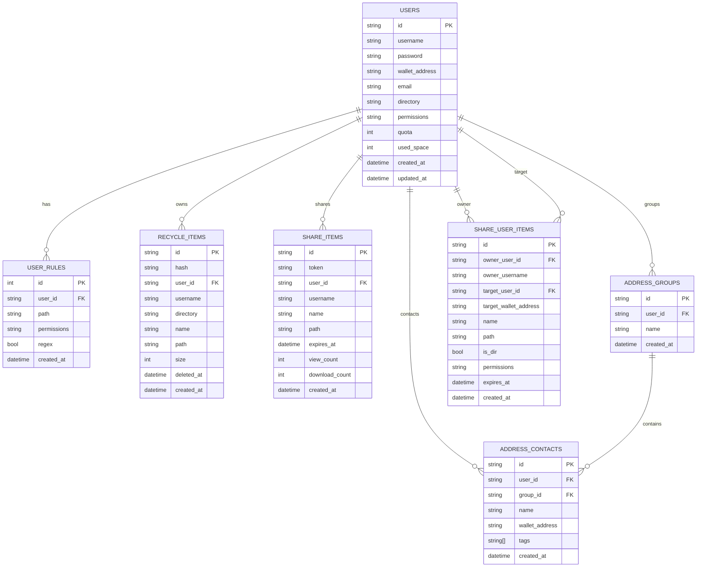

# 数据模型

本文档概述 PostgreSQL 数据表结构与核心字段。

## ER 图

## 关键表说明

- **users**：用户主表，包含权限、配额与钱包地址。
- **user_rules**：路径级权限规则，优先于默认权限。
- **recycle_items**：回收站记录，用于恢复或永久删除。
- **share_items**：公开分享记录，按 token 访问。
- **share_user_items**：定向分享记录（指定 target 用户）。
- **address_groups / address_contacts**：地址簿与联系人分组。

## 重要索引/约束（摘要）

- `users.username` 唯一
- `users.wallet_address` 唯一（非空时）
- `users.email` 唯一（非空时）
- `share_items.token` 唯一
- `recycle_items.hash` 唯一
- `address_groups(user_id, name)` 唯一
- `address_contacts(user_id, wallet_address)` 唯一
