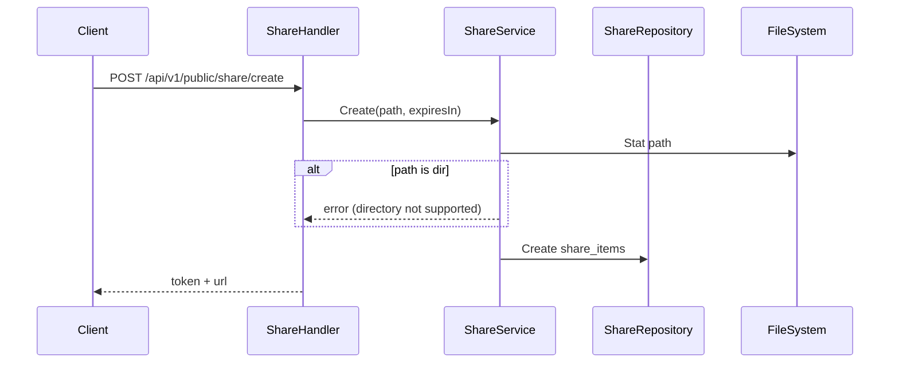
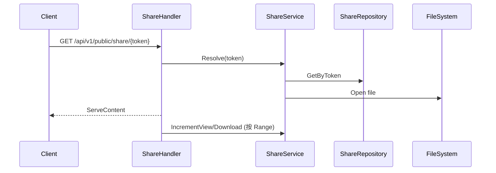
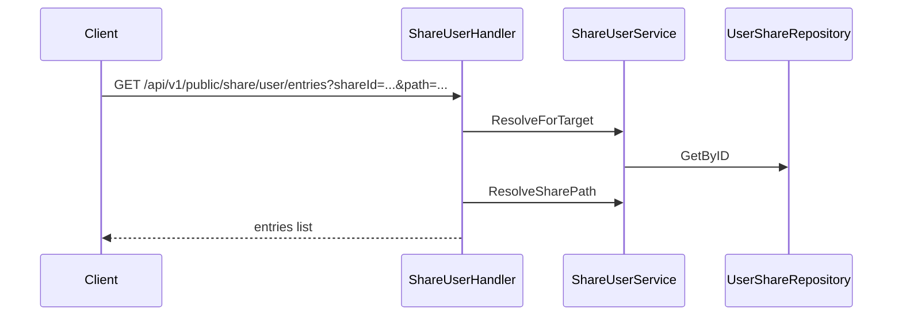

# 分享与回收站设计

本文档描述公开分享、定向分享以及回收站的核心流程。

## 公开分享（Share）

### 创建流程

- 公开分享仅支持文件，不支持目录。
- `expiresIn` > 0 时生成过期时间。

### 访问流程

- `Range` 非首段请求不会增加计数，避免分片导致膨胀。

## 定向分享（Share User）

### 创建与权限

- 目标用户通过钱包地址匹配。
- `permissions` 可包含 `read/create/update/delete`（或 `CRUD` 字符串）。
- 支持文件或目录分享。
- 创建成功后自动把目标地址写入地址簿（若不存在）。

### 使用流程（示例）

- 下载、上传、创建目录、重命名、删除均会先校验对应权限位。

## 回收站

### 写入回收站（由 WebDAV DELETE 触发）

- WebDAV 删除会尝试把文件移动到 `.recycle` 目录。
- 同时写入 `recycle_items`，记录 hash/路径/大小/删除时间。

### 恢复/清理

- `recover`：将回收站文件移动回原路径，若原路径已存在则失败。
- `permanent`：删除回收站文件并移除记录。
- `clear`：批量清空。

### 文件命名策略

- 新规则：`{hash}_{原文件名}`
- 兼容旧规则：`{username}_{directory}_{name}_{timestamp}`

