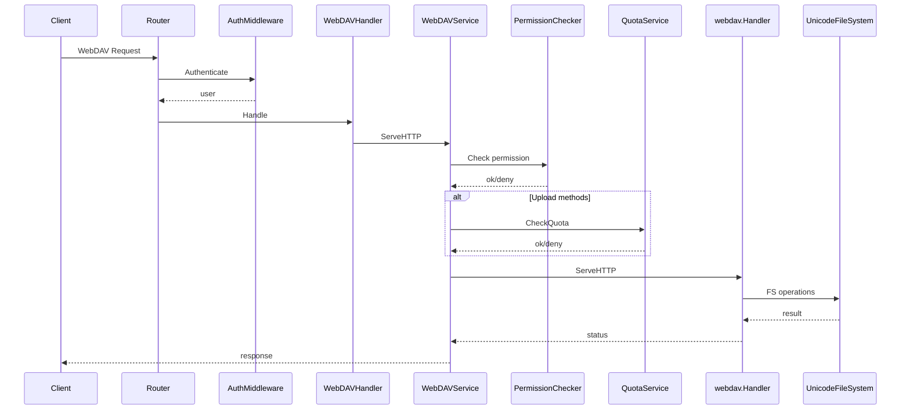
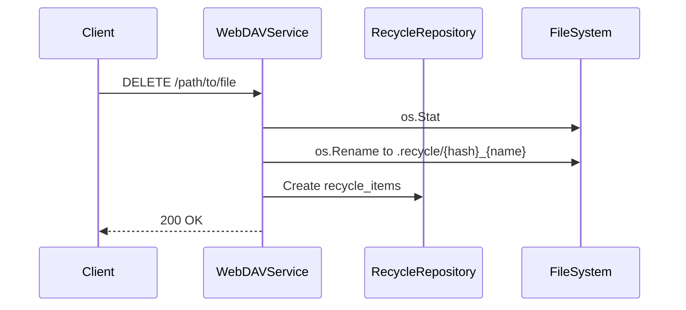

# WebDAV 请求处理流程

本文档描述 WebDAV 请求在服务端的处理链路、权限与配额校验、以及回收站行为。

## 处理链路总览

## 关键步骤说明

1. **认证**：通过 `AuthMiddleware` 获取用户信息，未授权直接拒绝。
2. **忽略系统文件**：对 `.DS_Store` / `.AppleDouble` / `Thumbs.db` / `._*` 等特殊路径返回 404/204。
3. **用户目录解析**：
   - `user.Directory` 为绝对路径时直接使用
   - 否则拼接为 `webdav.directory + user.Directory`
   - 若未设置 `user.Directory`，回退到 `webdav.directory`
   - 权限校验时使用 `user.Directory` 或 `user.Username` 作为逻辑前缀来组装路径
4. **权限校验**：将 HTTP 方法映射为权限操作（C/R/U/D），使用用户规则或默认权限判断。
5. **配额校验**：对 `PUT/POST/MKCOL` 检查追加大小是否超出 `user.quota`。
6. **WebDAV 处理**：
   - 使用自定义 `UnicodeFileSystem`，确保 Unicode 路径正确处理
   - 使用内存锁 `webdav.NewMemLS()`
7. **删除行为**：`DELETE` 默认移动到回收站目录 `.recycle` 并记录数据库。
8. **用量刷新**：对写操作成功后重新计算 `used_space` 并持久化。

## WebDAV 方法与权限映射

- `GET/HEAD/OPTIONS/PROPFIND` → Read (`R`)
- `PUT/PATCH/PROPPATCH` → Write (`U`)
- `POST/MKCOL` → Create (`C`)
- `COPY/MOVE` → Write (`U`)
- `DELETE` → Delete (`D`)
- 其他方法默认映射为 Read

权限匹配逻辑：

1. 若路径命中 `user_rules`，使用规则权限。
2. 否则使用 `users.permissions` 默认权限。

注意：`user_rules.regex=true` 的正则匹配当前未实现，实际只支持前缀匹配。

## DELETE 回收站流程

- 若移动失败，会回退为直接删除。
- 回收站文件命名规则：`{hash}_{原文件名}`。

## MOVE/COPY 目的路径规范化

对 `Destination` Header 做解码和规范化，避免代理或编码导致的路径异常。
